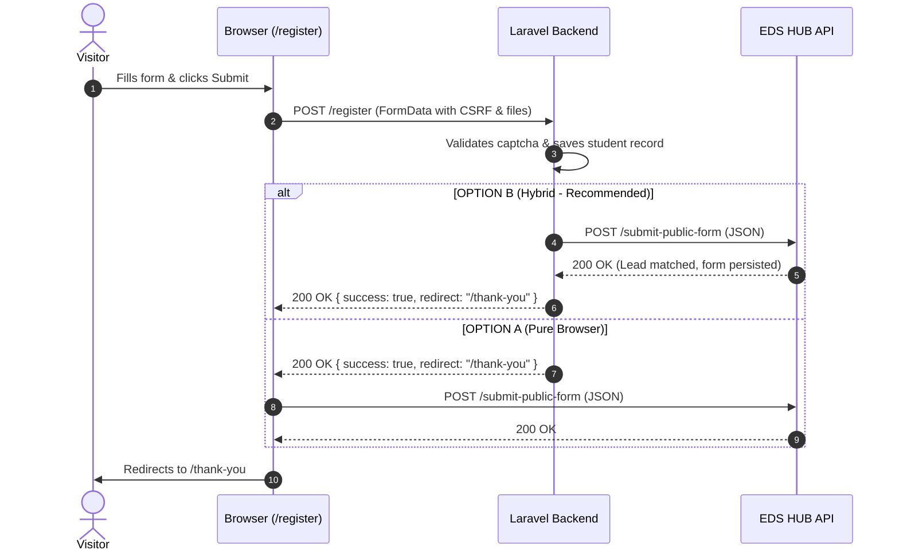

# EDS Website (`/register`) → EDS HUB CRM Integration & Production Fix Handoff

> **Status:** WAITING FOR WEBSITE DEVELOPER  
> **Target Production Page:** `https://www.expdentalsolutions.com/register`  
> **Form ID:** `#registerForm`  
> **Host Architecture:** External Laravel Application (`/home2/expden18/public_html`)  
> **Target CRM:** EDS HUB (Production Supabase: `https://xogcexclqiornuscsdmn.supabase.co`)  
> **Date:** September 2026

---

## A. Current Observed Bug

When a real visitor or the client fills out and submits the registration form on `https://www.expdentalsolutions.com/register`:
1. The submission currently does not reach the EDS HUB CRM at all.
2. In the browser source code of `/register` (lines 845–854 of the page template), the form handler submits exclusively to `https://www.expdentalsolutions.com/register` (the local Laravel endpoint) using `fetch(form.action, ...)`.
3. The Laravel application does not include any integration script (`eds-register-integration.js` or equivalent) on the frontend.
4. The Laravel backend controller (`RegistrationController.php`) does not forward completed registrations to the EDS HUB endpoint (`submit-public-form`).
5. Live server testing reveals that submitting without meeting all server-side requirements (such as Google reCAPTCHA, required file uploads `passport` and `dental_license`, or unhandled server exceptions) returns an HTTP 422 or 500 error without logging or notifying EDS HUB of the attempted registration.
6. As a result, prospective leads who attempt to register or encounter friction are completely lost to the sales and admissions team.

---

## B. Exact Integration Endpoints

EDS HUB provides two hardened, public-safe endpoints:

1. **Incomplete / Abandoned Attempt Ingestion & Failure Reporting:**
   `https://xogcexclqiornuscsdmn.supabase.co/functions/v1/capture-incomplete-enrollment`

2. **Completed Registration Form Ingestion:**
   `https://xogcexclqiornuscsdmn.supabase.co/functions/v1/submit-public-form`

---

## C. HTTP Method

Both endpoints require:
`POST`

*(OPTIONS preflight is fully supported with CORS headers).*

---

## D. Required Headers

```http
Content-Type: application/json
apikey: sb_publishable_AyrxHrDnvNXwKvk1kBDqng_TgqHMPdw
```

*(Note: `apikey` is the public Supabase publishable key. Never use or expose the private `service_role` key).*

---

## E. Exact Payload Schema

### 1. Completed Registration (`submit-public-form`)

```json
{
  "form_slug": "website-register",
  "idempotency_key": "comp_att_1790692798814_abc123",
  "external_attempt_id": "att_1790692798814_abc123",
  "first_name": "John",
  "last_name": "Smith",
  "name": "Dr. John Smith",
  "email": "john.smith@example.com",
  "phone": "+19415550199",
  "contact_preference": "email",
  "course": "Wisdom Teeth Training - November 7-10, 2026 | Tuition: $8,200",
  "course_code": "WTT-01",
  "specialty": "General Practitioner",
  "years_in_practice": "5-9 years",
  "surgical_experience": "Moderate surgical experience",
  "agd_number": "AGD-987654",
  "heard_from": "Google",
  "referral_name": "Dr. Carlos Santos",
  "promo_code": "EDS2026",
  "terms_accepted": true,
  "source_page": "https://www.expdentalsolutions.com/register",
  "utm_source": "google",
  "utm_medium": "cpc",
  "utm_campaign": "wisdom_teeth_2026",
  "utm_term": "hands-on wisdom course",
  "utm_content": "hero_apply_button"
}
```

### 2. Incomplete / Failed Registration (`capture-incomplete-enrollment`)

```json
{
  "idempotency_key": "inc_att_1790692798814_abc123_WTT-01",
  "external_attempt_id": "att_1790692798814_abc123",
  "first_name": "John",
  "last_name": "Smith",
  "email": "john.smith@example.com",
  "phone": "+19415550199",
  "course_code": "WTT-01",
  "status": "needs_followup",
  "source_page": "https://www.expdentalsolutions.com/register",
  "utm_source": "google",
  "utm_medium": "cpc",
  "utm_campaign": "wisdom_teeth_2026"
}
```

*(For failed submissions, set `"status": "submission_failed"` and include `"error_code": "VALIDATION_FAILED"`).*

---

## F. Required vs Optional Fields

### Completed Registration (`submit-public-form`):
- **Required:**
  - `form_slug`: `"website-register"`
  - `idempotency_key`: string (min 8 chars, unique per submission attempt)
  - `email` OR `phone`: at least one valid contact identifier
  - `course` OR `course_code`: course interest title or code
- **Optional (Approved Business Fields):**
  - `name`, `first_name`, `last_name`, `contact_preference` (`email` | `sms` | `call` | `whatsapp`), `specialty`, `years_in_practice`, `surgical_experience`, `agd_number`, `heard_from`, `referral_name`, `promo_code`, `terms_accepted`, `source_page`, UTM parameters (`utm_source`, `utm_medium`, `utm_campaign`, `utm_term`, `utm_content`).

### Incomplete Registration (`capture-incomplete-enrollment`):
- **Required:**
  - `idempotency_key`: string
  - `email` OR `phone`: at least one contact identifier
  - `course_code` OR `course_id`: course identifier
- **Optional:**
  - `first_name`, `last_name`, `external_attempt_id`, `status` (`needs_followup` | `submission_failed`), `error_code`, `source_page`, UTM parameters.

---

## G. Idempotency Key Behavior

- For Incomplete captures: prefix with `inc_` + attempt ID + course code. Re-sending with the same key returns the existing record without duplicating tasks or push notifications.
- For Completed submissions: prefix with `comp_` + attempt ID. Re-submitting the same key returns HTTP 200 with `"is_duplicate": true` and the original submission outcome.

---

## H. `external_attempt_id` / `eds_form_attempt_id` Behavior

1. When a user lands on `/register`, generate or read a unique session attempt ID from `sessionStorage` (e.g. `att_1790692798814_abc123`).
2. Inject a hidden input `<input type="hidden" name="eds_form_attempt_id" value="...">` into `#registerForm`.
3. When the user enters their contact information and course, pass this attempt ID as `external_attempt_id` to `capture-incomplete-enrollment`.
4. When the user successfully submits, pass the identical `external_attempt_id` to `submit-public-form`.
5. Upon successful completion, EDS HUB automatically updates the incomplete attempt to `completed` and resolves any pending follow-up task. The frontend script clears `sessionStorage.removeItem('eds_form_attempt_id')`.

---

## I. Completed Submission Flow



---

## J. Incomplete Attempt Flow

1. Visitor fills in Name, Email, and selects a Course.
2. The browser debounces user input (1.5s delay).
3. If Email or Phone is present and Course is selected, the browser fires an asynchronous `fetch` to `capture-incomplete-enrollment`.
4. EDS HUB creates a lead in `Novo Lead` (stage `capture`), generates an internal follow-up task (`Retomar inscrição: [Course]`), and triggers a push alert to the admin:
   `Inscrição não concluída — [Name] tentou se inscrever em [Course]. Verifique o formulário e faça o acompanhamento.`
5. If the visitor abandons without submitting, the team can follow up immediately.

---

## K. Failed Submission Flow

1. If the user clicks Submit and the Laravel endpoint returns an error (422 validation error, 500 server error, or network timeout):
2. The frontend script calls `window.reportEdsHubSubmissionFailure(status, message)`.
3. EDS HUB logs the attempt with `status: 'submission_failed'` and alerts the admissions team so they can assist the student.

---

## L. Frontend Validation

- Ensure that client-side validation gives immediate, clear feedback before submission.
- Validate that:
  - Email has valid format and matches `email_confirmation`.
  - Phone has valid digits (E.164 or formatted).
  - Terms checkbox is checked.
  - Required attachments (`passport`, `dental_license`) are selected and under 5MB.
  - reCAPTCHA is completed.

---

## M. Backend Response Handling

- **EDS HUB Success Response (HTTP 200/201):**
  ```json
  {
    "success": true,
    "lead_id": "f8e9607c-615d-477d-b8aa-6ee7eb76b589",
    "submission_id": "434d1683-80bd-4c14-878a-f00174c0aa0b",
    "processing_status": "processed",
    "success_message": "Obrigado pela sua inscrição! Entraremos em contato em breve."
  }
  ```
- **EDS HUB Validation Error (HTTP 400/422):**
  ```json
  {
    "error": "At least one contact identifier (email or phone) is required",
    "error_code": "VALIDATION_FAILED"
  }
  ```

---

## N. CORS Requirements

- Both `https://expdentalsolutions.com` and `https://www.expdentalsolutions.com` are whitelisted production origins on EDS HUB Edge Functions.
- CORS preflight (`OPTIONS`) returns HTTP 200 with standard headers.

---

## O. Timeout and Error Handling

- Set a 6-second timeout on all outbound requests to EDS HUB.
- Ensure that calls to EDS HUB are **non-blocking**: if EDS HUB is momentarily unreachable, the student's local registration on Laravel and redirect to `/thank-you` must NOT fail. Log the error in Laravel logs (`storage/logs/laravel.log`).

---

## P. Retry Policy

- If a network error occurs during submission, retry once after 1 second using the same `idempotency_key`.

---

## Q. Privacy Field Exclusions (CRITICAL)

The following fields must **NEVER** be sent to EDS HUB:
- `medical_conditions` (patient/student sensitive health notes)
- `passport` (raw binary upload)
- `dental_license` (raw binary upload)
- Passwords or credentials
- Payment details / credit card numbers
- Raw session / CSRF tokens

---

## R. Success UI Behavior

- Upon HTTP 200, display a clear success confirmation and redirect to `https://www.expdentalsolutions.com/thank-you`.
- Do not let the button remain in a spinning/disabled state indefinitely.

---

## S. Failure UI Behavior

- Display user-friendly message: `"We were unable to complete your registration. Please check the highlighted fields or contact us directly at +1 (941) 830-1451."`
- Never expose raw SQL or internal exception stack traces to the visitor.

---

## T. Controlled Production Test Instructions

1. **Step 1: Test Incomplete Capture**
   - Open `https://www.expdentalsolutions.com/register` in an incognito window.
   - Enter:
     - Name: `Dr. Incomplete Test`
     - Email: `incomplete.audit@example.com`
     - Phone: `+19415550111`
     - Course: Select `Wisdom Teeth Training`
   - Wait 3 seconds, then close the tab without submitting.
   - In EDS HUB: Verify a new lead `Dr. Incomplete Test` appears in pipeline stage `Novo Lead` with a pending task `Retomar inscrição: Wisdom Teeth Training`.

2. **Step 2: Test Completed Registration**
   - Open `https://www.expdentalsolutions.com/register`.
   - Fill out all required fields with:
     - Email: `incomplete.audit@example.com`
   - Submit the form and confirm redirect to `/thank-you`.
   - In EDS HUB: Verify that no duplicate lead was created, the lead has `"has_new_submission": true`, the previous follow-up task is marked completed, and the full dynamic form appears under **"Formulário do Lead"**.

---

## Copy-Paste Code Files Provided in This Repository

1. **Browser Client Script:** [`website-register-example.js`](file:///c:/Users/luisa/Documents/EDS%20HUB/EDS-HUB/website-register-example.js)
2. **Laravel Controller & Service:** [`website-register-laravel-controller.php`](file:///c:/Users/luisa/Documents/EDS%20HUB/EDS-HUB/website-register-laravel-controller.php)
3. **Canonical Test Payload:** [`website-register-test-payload.json`](file:///c:/Users/luisa/Documents/EDS%20HUB/EDS-HUB/website-register-test-payload.json)
